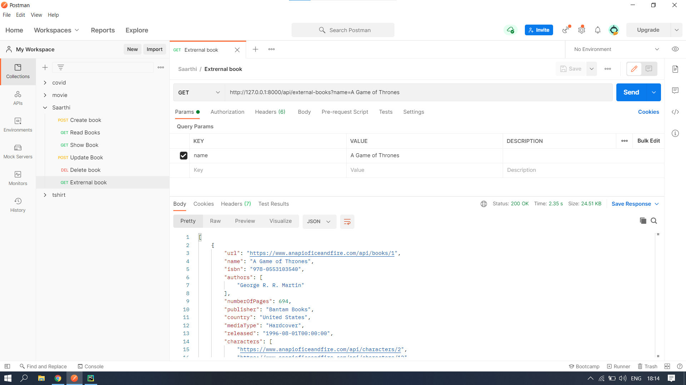
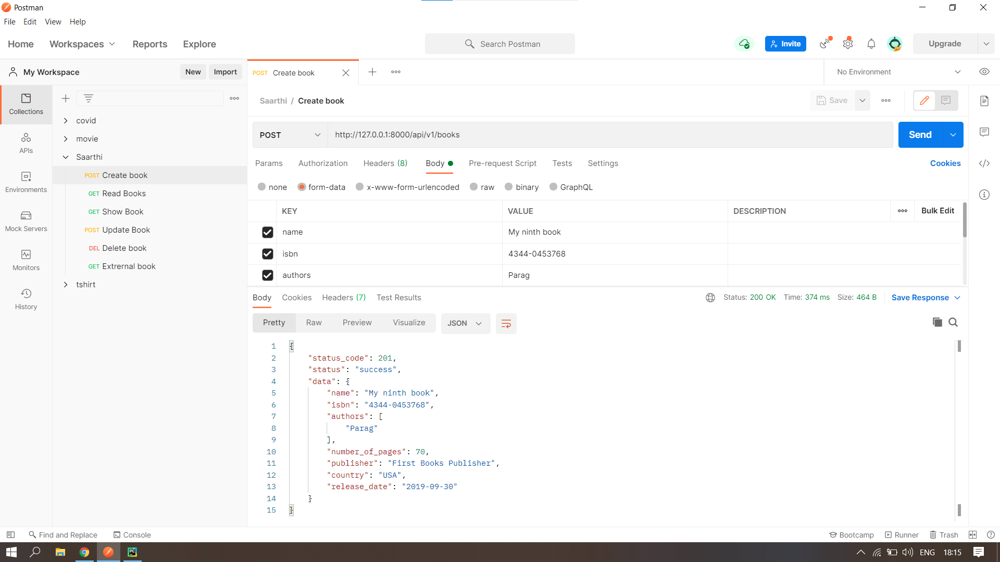
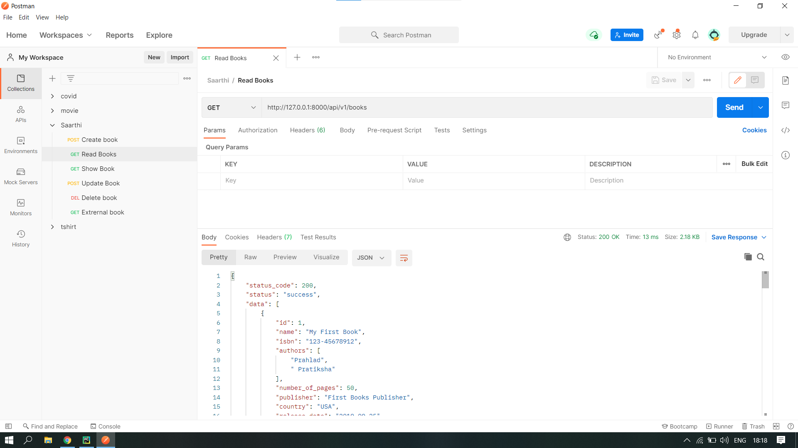
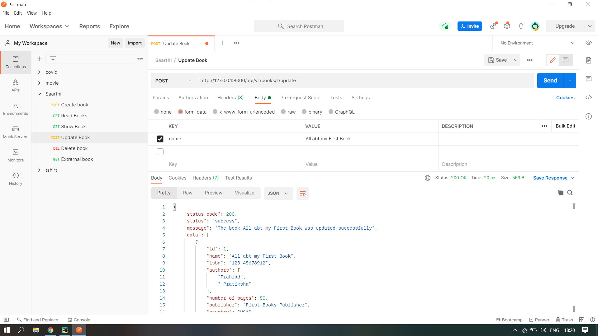
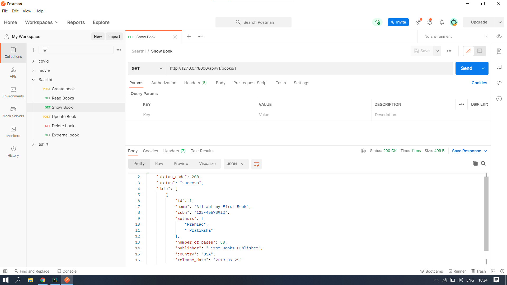
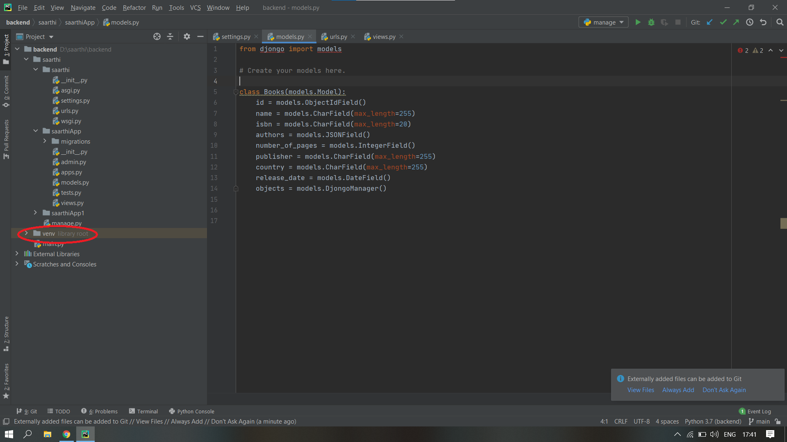

# saarthi_backend_prahlad_nayak

### External books (GET method) -

### Creating a book (POST method) -

### Reading all books in the DB (GET method) -

### Updating a book(here updating book with id = 1) (POST method) -

### Deleting a book(here deleting book with id = 4) (DELETE method) -

### Showing a book(here showing book with id = 1) (GET method) -


## Getting Started

### Install
1. Download or clone the repository.
2. Open Pycharm or any other IDE.
3. Create a new virtual environment for the project. After this step, the venv directory should be generated as generated in the below screenshot.

4. Restart the IDE.
5. Go to the Pycharm terminal and install these dependencies.
  ```bash
pip install django
```
  ```bash
pip install requests
```   
  ```bash
pip install djongo
```
6. Run the manage.py file
7. Go through the following urls: <br>
  (i) External books (GET method) - 
    ```http://127.0.0.1:8000/api/external-books?name=A Game of Thrones``` <br>
  (ii) Creating a book (POST method) - 
    ```http://127.0.0.1:8000/api/v1/books``` <br>
  (iii) Reading all books in the DB (GET method) - 
    ```http://127.0.0.1:8000/api/v1/books``` <br>
  (iv) Updating a book(here updating book with id = 1) (POST method) - 
    ```http://127.0.0.1:8000/api/v1/books/1/update``` <br>
  (v) Deleting a book(here deleting book with id = 4) (DELETE method) - 
    ```http://127.0.0.1:8000/api/v1/books/4``` <br>
  (vi) Showing a book(here showing book with id = 1) (GET method) - 
    ```http://127.0.0.1:8000/api/v1/books/1``` <br>
